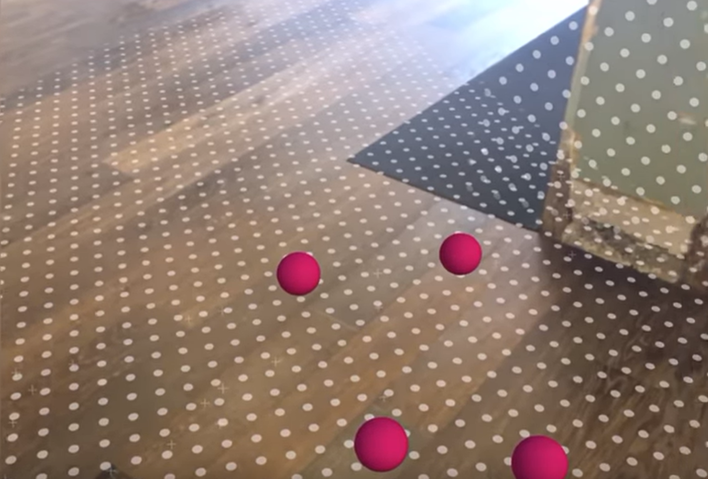

# Project 3: Barrel Bouncer AR Edition

## Part 3: Enabling Plane Detection and Visualization

Go to your _**AR Session Origin**_ GameObject and add the _**AR Plane Manager**_ component to it. You will notice that it has two properties that you can set: _**Plane Prefab**_ and _**Detection Mode**_. The former is the reference to the prefab that the plane manager should use to visualize the planes it detects. The latter defines what types of planes (i.e. horizontal, vertical) the plane manager should be tracking.

Let's create the plane prefab. On your menu bar, go to `GameObject` -> `XR` -> `AR Default Plane`. This will create a new gameobject that defines the plane's visualization to look like this:

However, we want the planes in our game to look a little nicer, perhaps something like this dotted pattern:

Unity calls this a _"feathered plane"_, because the material fades out towards the edges of the plane. According to [this link](https://whatis.techtarget.com/definition/feather), the term feathering refers to:

- _"In graphic design, to feather is to soften an edge of an image by making the edge gradually fade out until it becomes transparent. In computer graphics, feathering blurs the edges of an image by building a transition boundary between the selection and its surrounding pixels. Because feathering is set by a radius measurement in pixels, the feathering occurs on both sides of the selection boundary."_

This feathered plane shown in the screenshot above uses a material that is included in the AR Foundation samples, but isn't part of AR Foundation itself. We have provided it for you as part of our unitypackage.

On your _**AR Default Plane**_ GameObject, find its _**Mesh Renderer**_ component and drag the _**FeatheredPlaneMaterial**_ (which can be found in the _**Materials**_ folder in your project window) into its _**Materials**_ property. Next, remove the _**Line Renderer**_ component from the GameObject (since the default visualization draws a black line around the planes' boundaries, but we don't want that in ours) and add the _**AR Feathered Plane Mesh Visualizer**_ script to it (this helps ensure that the feathering effect only occurs towards the planes' boundaries).

Once you have done these steps, drag the GameObject into the project window to make a prefab out of it, and then delete the instance from your scene. You may rename the prefab for clarity, if you would like. Finally, set it as the _**Plane Prefab**_ that should be used for visualizations by dragging it into the appropriate slot on the _**AR Plane Manager**_.

### Bonus Task (Optional)

- Create a custom feathered plane visualization as shown in [this tweet](https://twitter.com/DanMillerDev/status/1052256682099666945).
- Enable the effect of only showing plane visualization when the understanding of the plane changes and fading it out otherwise (i.e. if the understanding remains the same). This effect is shown in [this video clip](https://youtu.be/ml9qVRdEH4k?t=208) and the AR Foundation samples described in [Part 0](../tools/#resources-and-examples) already have all the assets necessary to complete this task. It is your job to figure out what assets you will need to copy over into your project and how you can then apply the effect onto your plane prefab.

## [Previous Section](../ar-scene) | [Go Home](..) | [Next Section](../set-up-barrels)
